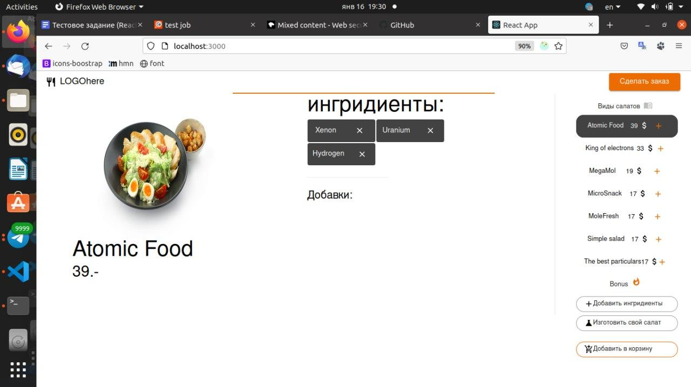

## Тестовое задание

В этом тестовом задании использовал такие библиотеки как React, Redux-Toolkit, Mui.  Так же добавил Typescript, мне удобнее с ним.
 
 ### Склонируйте репозиторий, установите зависимости и запустите проект

```
git clone https://github.com/Ya-maz/avk-groupe-tomsk.git
cd /avk-groupe-tomsk

npm istall
npm run start

```

Откройте [http://localhost:3000](http://localhost:3000)




Должно получится примерно так. 

К сожалению, backend, согласно документации,находится на http, поэтому не получилось подключить рабочий gh-pages(https) для демонстрации.

### Функционал
  #### Есть возможность:
- Выбрать любой салат из списка(в правой части в меню)  и посмотреть из каких ингрединетов состоит салат.
- Выбрать салат и также добавить ингридиенты, для этого нажать на кнопку "добавить ингриденты" и появится список молекул.  Нажать кнопку "плюс" оранжевого цвета.
- Удалить добавленные ингредиенты. 
- Добавить салат(ы) в условную корзину. Для этого в списке салатов нажать оранжевую кнопку. После этого в кнопке "добавить в корзину" придет уведомления.
- Сделать заказ. Для этого, если корзина не пустая, нажать на кнопку сделать заказ.


В случае возникновения ошибки, приложение выдаст модальное окно с текстом ошибки.

